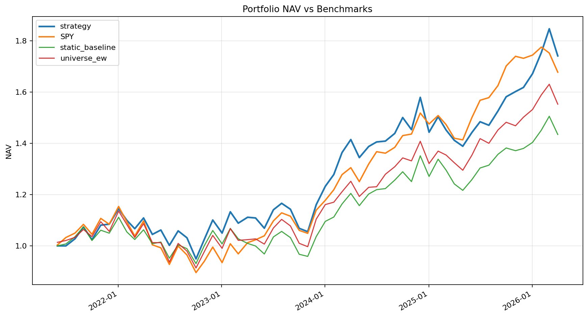
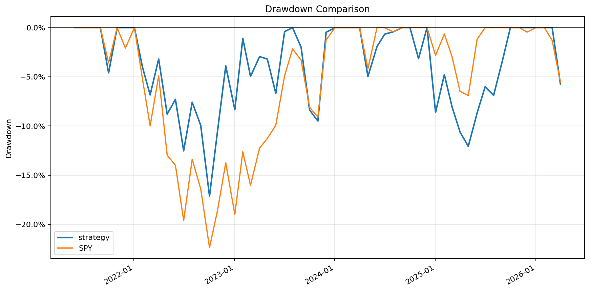
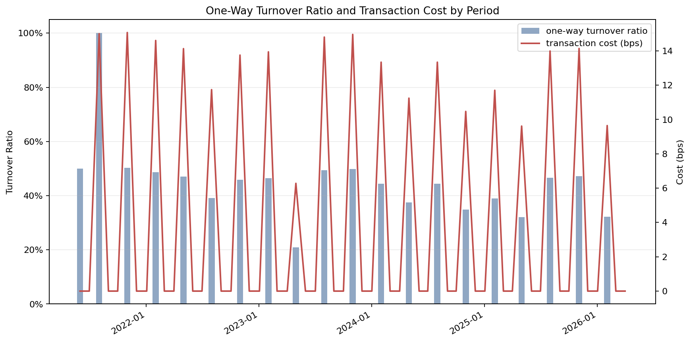
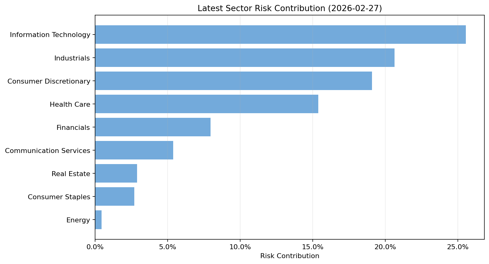

# CW2 Backtest Report: cw2_formal_fund_ra3_s30_t50_20260420_report

## Overview
- Run ID: `6905e84b-9e16-4106-8c0f-cd9ecce56728`
- Backtest run name: `cw2_formal_20260420_20260429T031646Z_01_fund_ra3_s30_t50`
- Window: `2021-04-20` to `2026-04-20`
- Rebalance frequency: `quarterly`
- Benchmark ticker: `SPY`
- Primary benchmark for analysis: `SPY`
- Transaction cost assumption (all-in): `15 bps`
- Model version: `cw2-model-2026.04`
- Backtest engine version: `cw2-backtest-2026.04`
- Reporting version: `cw2-reporting-2026.04`
- Generated at: `2026-04-30T16:14:16.158013+00:00`

## Performance Snapshot
- Total return: 74.12%
- Annualized return: 11.94%
- Gross annualized return: 12.49%
- Annualized volatility: 15.82%
- Max drawdown: 17.13%
- Sharpe ratio: 0.582
- MAR ratio (full-period max drawdown): 0.697
- Excess annualized return vs primary benchmark: 0.84%
- Information ratio vs primary benchmark: 0.126
- Hit rate vs benchmark ticker: 50.85%
- Average monthly turnover ratio (one-way): 15.35%
- Average monthly turnover ratio (two-way): 27.32%
- Annualized turnover ratio (one-way): 184.23%
- Raw beta vs benchmark ticker: 0.955

## Execution Realism
- Average requested turnover ratio (one-way): 15.35%
- Average executed turnover ratio (one-way): 15.35%
- Average requested traded weight (two-way): 27.32%
- Average executed traded weight (two-way): 27.32%
- Average turnover shortfall from clipping: 0.00%
- Liquidity-clipped periods: `0`
- Average unfilled buy weight: 0.00%
- Average unfilled sell weight: 0.00%
- Max total unfilled weight in a period: 0.00%
- Average max participation used: 0.11%
- Forward-filled periods: `0`
- Forward-filled symbol observations: `0`
- Forward-filled symbol-days: `0`

## Trade Blotter
- Unified trade blotter rows: `855`
- Scheduled execution rows: `855`
- Intraday action rows: `0`
- Liquidity-clipped blotter rows: `0`
- Forward-filled blotter rows: `0`
- Full CSV artifact: `trade_blotter.csv`

Turnover convention:
Reported turnover uses the common one-way ratio (0.5 * sum of absolute weight changes). Two-way traded weight is also shown as the full sum of absolute weight changes.

## Benchmark Construction Notes
- `SPY` is the primary benchmark for analysis; cost treatment is `no_strategy_execution_cost_model`.
- `universe_ew` is retained as an additional comparison series; cost treatment is `gross_of_trading_costs`.
- `static_baseline` is rebuilt on the same CW2 factor stack and is net of configured trading costs (`15 bps`); benchmark execution metrics are shown separately when available.
- Sharpe and Sortino ratios are reported relative to period-aligned `us_treasury_3m` risk-free returns, compounded across each holding window from the daily annualized yield series.
- Information ratio is reported as arithmetic annualized mean excess return divided by annualized tracking error.
- `beta_raw` is reported as covariance beta on raw strategy and benchmark returns; risk-free rate is not subtracted.
- `beta_raw` is retained as a descriptive exposure metric for how strongly strategy returns co-move with the benchmark ticker, which helps interpret market sensitivity in volatility and drawdown terms; it is not intended as a CAPM pricing parameter.
- `MAR ratio` is reported as annualized return divided by full-period maximum drawdown; report readers still accept legacy `calmar_ratio` rows from older runs as a backward-compatible fallback.

## Portfolio Risk Model Notes
- Portfolio covariance method: `fundamental_factor`.
- Analysis covariance method: `fundamental_factor`.
- Factor covariance form: `Sigma = X F X' + D`.
- Style exposures: `market_beta, size, value, momentum, quality, volatility, liquidity, dividend`.
- Sector exposures included: `True`.
- This covariance model is the optimizer's risk model. It is separate from the five composite-alpha factor groups and is used to estimate shared systematic risk across holdings.

## Charts
### Nav Vs Benchmarks

### Drawdown Comparison

### Turnover And Cost

### Latest Sector Risk Contribution

## Metrics Table

| Group | Metric | Value | Unit |
|---|---|---:|---|
| portfolio | annualized_turnover_ratio_one_way | 184.23% | % |
| portfolio | annualized_turnover_ratio_two_way | 327.79% | % |
| portfolio | avg_holdings | 34.475 | - |
| portfolio | avg_monthly_turnover_one_way | 15.35% | % |
| portfolio | avg_monthly_turnover_two_way | 27.32% | % |
| portfolio | avg_transaction_cost_bps | 4.1 | bps |
| portfolio | total_cost_drag | 0.55% | % |
| return | annualized_return | 11.94% | % |
| return | benchmark_total_return | 67.76% | % |
| return | best_month | 9.97% | % |
| return | excess_return_annualized | 0.84% | % |
| return | gross_annualized_return | 12.49% | % |
| return | pct_positive_months | 59.32% | % |
| return | total_return | 74.12% | % |
| return | worst_month | -8.61% | % |
| risk | annualized_volatility | 15.82% | % |
| risk | beta_raw | 0.955 | - |
| risk | max_drawdown | 17.13% | % |
| risk | max_drawdown_duration | 18.000 | months |
| risk | tracking_error | 7.47% | % |
| risk_adjusted | hit_rate_vs_benchmark_ticker | 50.85% | % |
| risk_adjusted | information_ratio | 0.126 | x |
| risk_adjusted | mar_ratio | 0.697 | x |
| risk_adjusted | sharpe_ratio | 0.582 | x |
| risk_adjusted | sortino_ratio | 0.917 | x |

## Benchmark Absolute Metrics

| Series | Total Return | Ann Return | Ann Vol | Max Drawdown | Sharpe | Sortino | MAR |
|---|---:|---:|---:|---:|---:|---:|---:|
| SPY | 67.76% | 11.10% | 14.61% | 22.37% | 0.568 | 0.881 | 0.496 |
| static_baseline | 43.46% | 7.62% | 14.15% | 16.27% | 0.352 | 0.536 | 0.468 |
| universe_ew | 55.28% | 9.36% | 15.07% | 19.55% | 0.448 | 0.700 | 0.479 |

## Benchmark Execution Metrics

| Series | Avg Turnover (One-Way) | Avg Turnover (Two-Way) | Annualized Turnover (One-Way) | Avg Transaction Cost | Total Cost Drag |
|---|---:|---:|---:|---:|---:|
| SPY | - | - | - | - | - |
| static_baseline | 88.52% | 177.05% | 1062.28% | 13.3 | 1.73% |
| universe_ew | - | - | - | - | - |

## Relative Metrics

| Versus | Metric | Value | Unit |
|---|---|---:|---|
| SPY | down_capture_ratio | 0.882 | x |
| SPY | excess_return_annualized | 0.84% | % |
| SPY | excess_return_total | 3.79% | % |
| SPY | hit_rate | 50.85% | % |
| SPY | information_ratio | 0.126 | x |
| SPY | max_drawdown_delta | -5.24% | % |
| SPY | tracking_error | 7.47% | % |
| SPY | up_capture_ratio | 0.965 | x |
| static_baseline | excess_return_annualized | 4.32% | % |
| static_baseline | excess_return_total | 21.37% | % |
| static_baseline | hit_rate | 57.63% | % |
| static_baseline | information_ratio | 1.048 | x |
| static_baseline | max_drawdown_delta | 0.86% | % |
| static_baseline | tracking_error | 4.02% | % |
| universe_ew | excess_return_annualized | 2.58% | % |
| universe_ew | excess_return_total | 12.13% | % |
| universe_ew | hit_rate | 59.32% | % |
| universe_ew | information_ratio | 0.452 | x |
| universe_ew | max_drawdown_delta | -2.42% | % |
| universe_ew | tracking_error | 5.46% | % |

## Backtest Regime Attribution Table

Rows in this table are generated directly from `systematic_equity.backtest_regime_attribution`. The regime buckets are post-hoc VIX-based market-state labels used for attribution analysis.

| Regime | Versus | N | Strategy Ann Return | Versus Ann Return | Excess Ann Return | Strategy Ann Vol | Versus Ann Vol | Strategy Sharpe | Versus Sharpe | Strategy MDD | Versus MDD | Hit Rate |
|---|---|---:|---:|---:|---:|---:|---:|---:|---:|---:|---:|---:|
| all | SPY | 59 | 11.94% | 11.10% | 0.84% | 15.82% | 14.61% | 0.582 | 0.568 | 17.13% | 22.37% | 50.85% |
| all | universe_ew | 59 | 11.94% | 9.36% | 2.58% | 15.82% | 15.07% | 0.582 | 0.448 | 17.13% | 19.55% | 59.32% |
| all | static_baseline | 59 | 11.94% | 7.62% | 4.32% | 15.82% | 14.15% | 0.582 | 0.352 | 17.13% | 16.27% | 57.63% |
| normal | SPY | 46 | 19.08% | 20.45% | -1.37% | 14.59% | 12.26% | 1.018 | 1.282 | 10.61% | 7.08% | 47.83% |
| normal | universe_ew | 46 | 19.08% | 16.90% | 2.18% | 14.59% | 13.11% | 1.018 | 0.974 | 10.61% | 9.65% | 56.52% |
| normal | static_baseline | 46 | 19.08% | 13.25% | 5.83% | 14.59% | 13.07% | 1.018 | 0.733 | 10.61% | 10.24% | 56.52% |
| stress | SPY | 13 | -10.07% | -16.54% | 6.47% | 18.90% | 19.44% | -0.584 | -0.946 | 17.13% | 22.37% | 61.54% |
| stress | universe_ew | 13 | -10.07% | -13.62% | 3.54% | 18.90% | 19.79% | -0.584 | -0.753 | 17.13% | 19.55% | 69.23% |
| stress | static_baseline | 13 | -10.07% | -10.17% | 0.09% | 18.90% | 17.06% | -0.584 | -0.673 | 17.13% | 16.27% | 61.54% |

## Post-Hoc Market-State Attribution Summary

This summary pivots the same attribution output into one row per market state, so the period distribution and benchmark-relative results can be read directly.

| Market State | N | Strategy Ann Return | Strategy Sharpe | Strategy MDD | Excess vs SPY | Hit vs SPY | Excess vs universe_ew | Hit vs universe_ew | Excess vs static_baseline | Hit vs static_baseline |
|---|---:|---:|---:|---:|---:|---:|---:|---:|---:|---:|
| all | 59 | 11.94% | 0.582 | 17.13% | 0.84% | 50.85% | 2.58% | 59.32% | 4.32% | 57.63% |
| normal | 46 | 19.08% | 1.018 | 10.61% | -1.37% | 47.83% | 2.18% | 56.52% | 5.83% | 56.52% |
| stress | 13 | -10.07% | -0.584 | 17.13% | 6.47% | 61.54% | 3.54% | 69.23% | 0.09% | 61.54% |

## Scorecard

| Criterion | Passed | Evidence |
|---|---|---|
| Positive long-run excess return vs primary benchmark | True | `{"excess_return_annualized_vs_primary_pct": 0.843966, "threshold": 0.0}` |
| Lower stress max drawdown than static baseline | False | `{"baseline_max_dd_stress_pct": 16.273526, "strategy_max_dd_stress_pct": 17.130801}` |
| At least two of Sharpe, Sortino, IR beat static baseline | True | `{"baseline_ir_vs_primary": -0.4627192612995017, "baseline_sharpe": 0.35220022757746533, "baseline_sortino": 0.5362895726351677, "metrics_beating": 3, "strategy_ir_vs_primary": 0.125923, "strategy_sharpe": 0.582195, "strategy_sortino": 0.916735, "threshold": 2}` |
| Excess return survives 25 bps cost robustness | None | `{"robustness_run_id_25bps": null, "skipped": true}` |
| Positive stress-period excess return vs static baseline | True | `{"stress_excess_ann_return_vs_static_pct": 0.094447, "threshold": 0.0}` |

## Trade Blotter Preview

| Trade Date | Source Layer | Action Type | Symbol | Trade Side | Weight Before | Weight After | Requested Trade Weight | Executed Trade Weight | Liquidity Clipped | Had Forward Fill | Forward Fill Days | Transaction Cost | Reason Code |
|---|---|---|---|---|---|---|---|---|---|---|---|---|---|
| 2021-07-01 | quarterly_rebalance | quarterly_rebalance_execution | AAPL | buy | 0 | 0.04959 | 0.04959 | 0.04959 | False | False | 0 | 0.000074 | scheduled_rebalance |
| 2021-07-01 | quarterly_rebalance | quarterly_rebalance_execution | ADBE | buy | 0 | 0.04959 | 0.04959 | 0.04959 | False | False | 0 | 0.000074 | scheduled_rebalance |
| 2021-07-01 | quarterly_rebalance | quarterly_rebalance_execution | AMZN | buy | 0 | 0.04959 | 0.04959 | 0.04959 | False | False | 0 | 0.000074 | scheduled_rebalance |
| 2021-07-01 | quarterly_rebalance | quarterly_rebalance_execution | COST | buy | 0 | 0.005 | 0.005 | 0.005 | False | False | 0 | 0.000008 | scheduled_rebalance |
| 2021-07-01 | quarterly_rebalance | quarterly_rebalance_execution | DG | buy | 0 | 0.005 | 0.005 | 0.005 | False | False | 0 | 0.000008 | scheduled_rebalance |
| 2021-07-01 | quarterly_rebalance | quarterly_rebalance_execution | DHR | buy | 0 | 0.032783 | 0.032783 | 0.032783 | False | False | 0 | 0.000049 | scheduled_rebalance |
| 2021-07-01 | quarterly_rebalance | quarterly_rebalance_execution | EQIX | buy | 0 | 0.04959 | 0.04959 | 0.04959 | False | False | 0 | 0.000074 | scheduled_rebalance |
| 2021-07-01 | quarterly_rebalance | quarterly_rebalance_execution | EXPD | buy | 0 | 0.04959 | 0.04959 | 0.04959 | False | False | 0 | 0.000074 | scheduled_rebalance |
| 2021-07-01 | quarterly_rebalance | quarterly_rebalance_execution | EXR | buy | 0 | 0.04959 | 0.04959 | 0.04959 | False | False | 0 | 0.000074 | scheduled_rebalance |
| 2021-07-01 | quarterly_rebalance | quarterly_rebalance_execution | GILD | buy | 0 | 0.005 | 0.005 | 0.005 | False | False | 0 | 0.000008 | scheduled_rebalance |
| 2021-07-01 | quarterly_rebalance | quarterly_rebalance_execution | GOOG | buy | 0 | 0.04959 | 0.04959 | 0.04959 | False | False | 0 | 0.000074 | scheduled_rebalance |
| 2021-07-01 | quarterly_rebalance | quarterly_rebalance_execution | HCA | buy | 0 | 0.04959 | 0.04959 | 0.04959 | False | False | 0 | 0.000074 | scheduled_rebalance |
| 2021-07-01 | quarterly_rebalance | quarterly_rebalance_execution | HD | buy | 0 | 0.04959 | 0.04959 | 0.04959 | False | False | 0 | 0.000074 | scheduled_rebalance |
| 2021-07-01 | quarterly_rebalance | quarterly_rebalance_execution | ICE | buy | 0 | 0.04959 | 0.04959 | 0.04959 | False | False | 0 | 0.000074 | scheduled_rebalance |
| 2021-07-01 | quarterly_rebalance | quarterly_rebalance_execution | IDXX | buy | 0 | 0.04959 | 0.04959 | 0.04959 | False | False | 0 | 0.000074 | scheduled_rebalance |
| 2021-07-01 | quarterly_rebalance | quarterly_rebalance_execution | KMB | buy | 0 | 0.04959 | 0.04959 | 0.04959 | False | False | 0 | 0.000074 | scheduled_rebalance |
| 2021-07-01 | quarterly_rebalance | quarterly_rebalance_execution | LOW | buy | 0 | 0.04959 | 0.04959 | 0.04959 | False | False | 0 | 0.000074 | scheduled_rebalance |
| 2021-07-01 | quarterly_rebalance | quarterly_rebalance_execution | MSFT | buy | 0 | 0.04959 | 0.04959 | 0.04959 | False | False | 0 | 0.000074 | scheduled_rebalance |
| 2021-07-01 | quarterly_rebalance | quarterly_rebalance_execution | NOC | buy | 0 | 0.04959 | 0.04959 | 0.04959 | False | False | 0 | 0.000074 | scheduled_rebalance |
| 2021-07-01 | quarterly_rebalance | quarterly_rebalance_execution | NTAP | buy | 0 | 0.04959 | 0.04959 | 0.04959 | False | False | 0 | 0.000074 | scheduled_rebalance |
