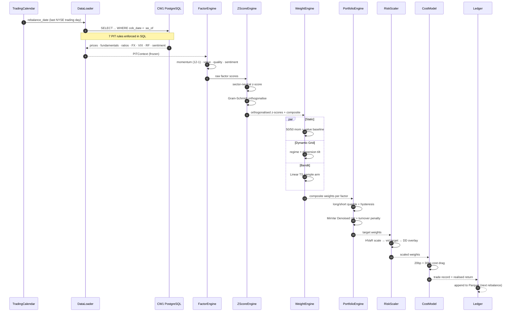
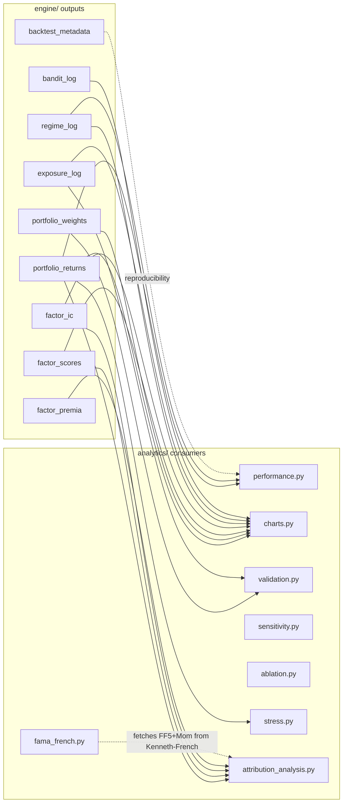
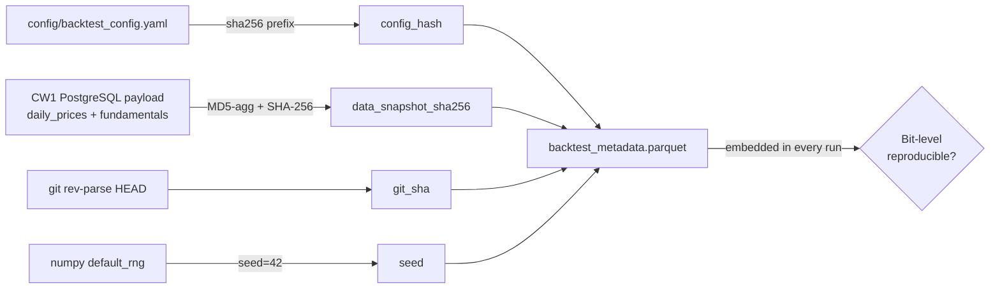

# CW2 Architecture Diagrams (Mermaid)

The diagrams below render directly in GitHub Markdown viewers and most
Sphinx themes via `sphinxcontrib-mermaid`.

---

## System Architecture

```mermaid
flowchart TB
  subgraph CW1["CW1 PostgreSQL (port 5439 · schema = systematic_equity)"]
    t1[daily_prices]
    t2[fundamentals EAV]
    t3[company_ratios EAV]
    t4[fx_rates]
    t5[vix_data]
    t6[risk_free_rate]
    t7[benchmark_index]
    t8[news_sentiment]
    t9[company_static]
  end

  subgraph CW2_ENG["engine/ — DEVELOPERS ONLY"]
    E1[data_loader.py<br/>PIT-enforced SQL]
    E2[factors.py<br/>4 factors + Gram-Schmidt]
    E3[zscore.py<br/>sector-neutral + composite]
    E4[portfolio.py<br/>MinVar · Denoised LW · HRP · turnover]
    E5[dynamic_weights.py<br/>VIX regime + dispersion]
    E6[bandit.py<br/>Linear Thompson Sampling]
    E7[risk_scaler.py<br/>HVaR · Vol-target · DD-overlay]
    E8[costs.py<br/>20/30 bp]
    E9[attribution.py<br/>Fama-MacBeth · Kyle's λ]
    E10[benchmark.py<br/>EW-univ · SPX · 50/50]
    E11[backtest.py<br/>DI event loop]
    E12[runner.py / Main.py]
  end

  subgraph CW2_ANA["analytics/ — SPECIALISTS ONLY"]
    A1[performance.py<br/>metrics · bootstrap · DSR · MBL]
    A2[validation.py]
    A3[charts.py<br/>14+ matplotlib figures]
    A4[sensitivity.py<br/>CPCV + purge + embargo]
    A5[ablation.py<br/>8 variants]
    A6[comparison.py]
    A7[stress.py<br/>3 crises + MC permutation]
    A8[attribution_analysis.py<br/>FF5+Mom Newey-West]
    A9[fama_french.py<br/>real FF data]
    A10[monte_carlo.py<br/>§7.5 bootstrap NAV paths]
    A11[regime_performance.py<br/>§7.6 per-regime metrics]
  end

  subgraph OUT["output/ — 17 Parquet files (Data Contract §6)"]
    P1[portfolio_returns<br/>+ hrp_net_20bp + long/short_leg]
    P2[portfolio_weights<br/>5 % iterative cap]
    P3[factor_scores]
    P4[factor_ic]
    P5[factor_premia]
    P6[regime_log]
    P7[exposure_log<br/>+ empirical β]
    P8[bandit_log]
    P9[backtest_metadata]
    P10[trade_ledger<br/>§7.9 immutable audit]
    P11[sensitivity_grid<br/>15 × 66 CPCV folds]
    P12[ablation_results<br/>8 variants]
    P13[stress_results]
    P14[permutation_test + null_dist]
    P15[monte_carlo_paths<br/>§7.5 — 10k bootstrap]
    P16[regime_performance<br/>§7.6 — per-regime × strategy]
  end

  subgraph DELIV["Deliverables"]
    D1[notebooks/CW2_Tearsheet.ipynb<br/>Plotly interactive]
    D2[charts/*.png<br/>300 DPI matplotlib]
    D3[Investment Strategy Report<br/>≤20,000 words]
    D4[Sphinx docs/]
  end

  CW1 --> E1
  E1 --> E2 --> E3
  E3 --> E5
  E3 --> E6
  E5 --> E11
  E6 --> E11
  E3 --> E4 --> E11
  E11 --> E7
  E7 --> E8
  E11 --> E9
  E10 --> E11
  E12 --> E11

  E11 --> P1
  E11 --> P2
  E11 --> P3
  E11 --> P4
  E11 --> P5
  E11 --> P6
  E11 --> P7
  E11 --> P8
  E11 --> P9

  OUT --> A1
  OUT --> A2
  OUT --> A3
  OUT --> A4
  OUT --> A5
  OUT --> A6
  OUT --> A7
  OUT --> A8
  A9 -.fetches.-> A8

  A1 --> D1
  A3 --> D2
  A3 --> D3
  D1 --> D3
  D4 -.docs.-> E1
  D4 -.docs.-> A1

  classDef cw1 fill:#1B2A4A,color:#fff,stroke:#fff
  classDef cw2e fill:#2E75B6,color:#fff,stroke:#fff
  classDef cw2a fill:#27AE60,color:#fff,stroke:#fff
  classDef out fill:#E67E22,color:#fff,stroke:#fff
  classDef deliv fill:#8E44AD,color:#fff,stroke:#fff

  class t1,t2,t3,t4,t5,t6,t7,t8,t9 cw1
  class E1,E2,E3,E4,E5,E6,E7,E8,E9,E10,E11,E12 cw2e
  class A1,A2,A3,A4,A5,A6,A7,A8,A9 cw2a
  class P1,P2,P3,P4,P5,P6,P7,P8,P9 out
  class D1,D2,D3,D4 deliv
```

---

## Monthly Rebalancing Sequence

---

## Data Contract (engine → analytics)

---

## Reproducibility Seal

