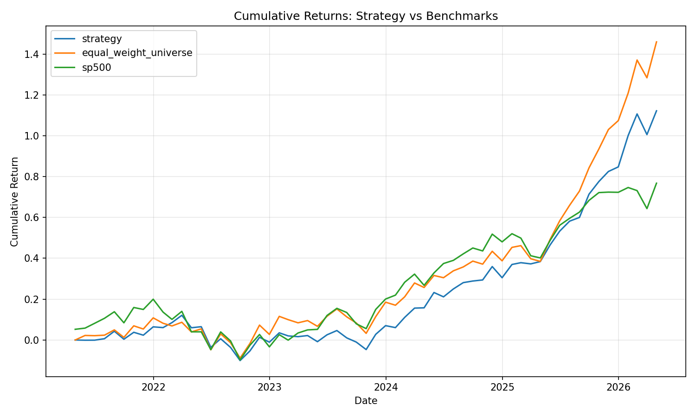
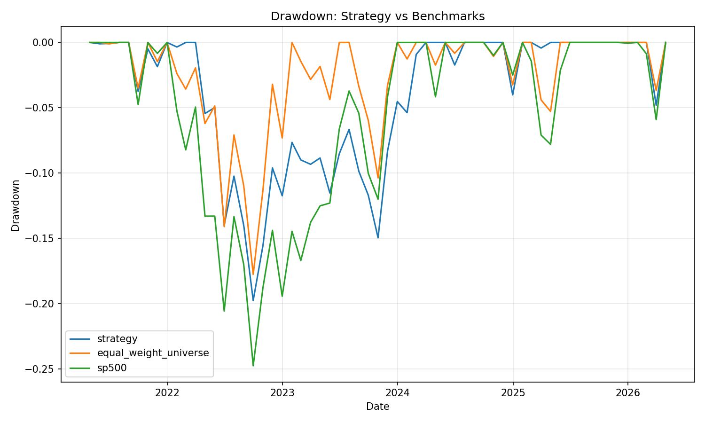
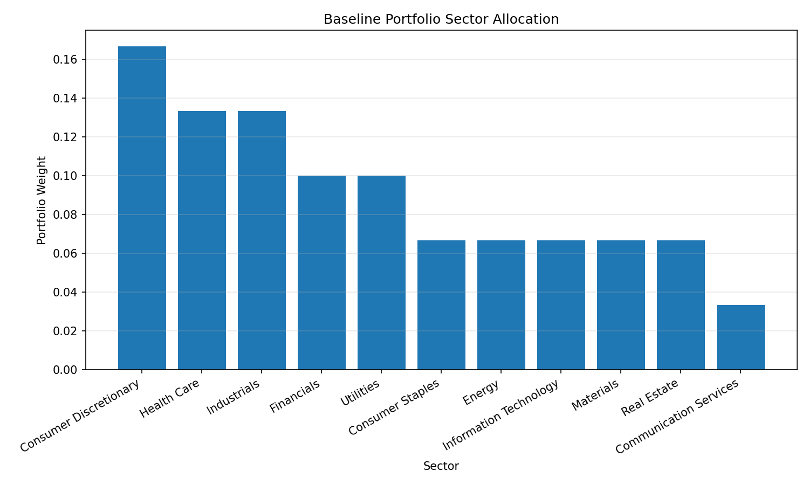
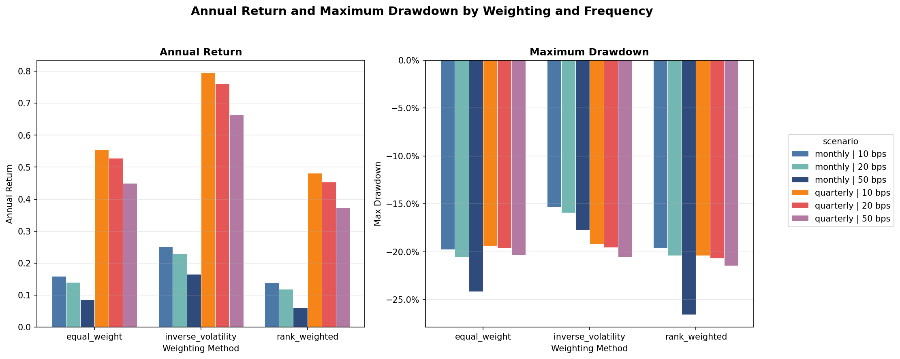
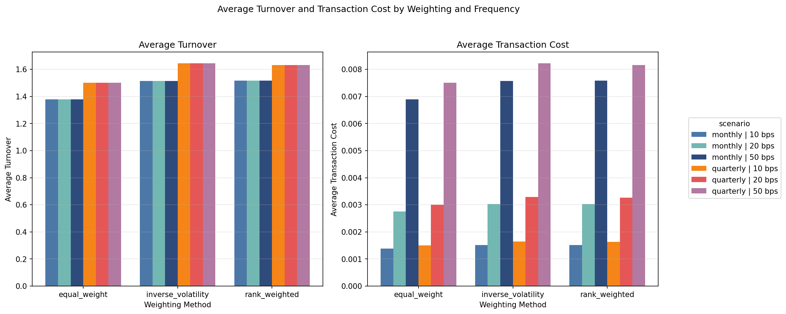

# Team Luzin — Coursework Two: Investment Portfolio Construction

*A composite-score-driven, long-only equity strategy built on Coursework One outputs — using approximately five years of historical prices, a 12-month warm-up for signal construction, and 49 out-of-sample monthly backtest observations with full benchmark comparison, rolling analytics, and robustness checks.*


> CW2 consumes the **frozen CW1 data product** — factor scores, price history, and GICS sector classifications — and turns them into a replicable investment product: portfolio construction, backtesting, benchmark comparison, rolling performance analytics, and robustness checks.

[Overview](#overview) · [Results](#headline-results) · [Pipeline](#pipeline-steps) · [Structure](#project-structure) · [Setup](#setup--run) · [Outputs](#outputs) · [Continuity](#continuity-from-cw1)

---

## Overview

This module operationalises the composite momentum / liquidity / risk signal produced by Coursework One into a systematic long-only equity portfolio. The strategy reconstructs monthly point-in-time snapshots inside CW2, selects the top 30 stocks from the eligible universe at each rebalance date, enforces two-layer sector concentration limits, assigns equal weights, and evaluates performance against two benchmarks over the full five-year history.

### Strategy at a Glance

| Parameter | Value |
|---|---|
| Selection signal | CW1 composite score (momentum + liquidity + risk-adjusted return) |
| Investable universe | 123 stocks |
| Portfolio size | 30 names |
| Sector cap — count | 9 names per GICS sector |
| Sector cap — weight | 30% max per sector (iterative rebalance) |
| Baseline weighting | Equal-weight |
| Transaction cost | 10 bps on turnover |
| Rebalance frequency | Monthly |
| Backtest mode | Rolling point-in-time snapshots built in CW2 |
| Benchmarks | Equal-weight universe · S&P 500 |
| Historical data horizon | Approximately five years of monthly price history |
| Signal lookback requirement | 12-month rolling lookback (warm-up period) |
| Out-of-sample evaluation window | Apr 2022 – Apr 2026 (49 monthly observations) |
| Robustness scenarios | 18 (3 methods × 2 frequencies × 3 cost levels) |

---

## Headline Results

The strategy uses approximately five years of price history.
A 12-month rolling lookback window is required for signal construction.
Therefore, the first year is treated as a warm-up period.
The final performance metrics are based on **49 out-of-sample monthly backtest observations** (Apr 2022 – Apr 2026).

### Absolute Performance

| Series | Cumulative Return | Annual Return | Volatility | Sharpe | Sortino | Max Drawdown | Win Rate |
|---|---|---|---|---|---|---|---|
| **Strategy** | **125.3%** | **22.0%** | 12.7% | **1.74** | **3.35** | -13.5% | 63.3% |
| Equal-Weight Universe | 127.3% | 22.3% | 16.5% | 1.35 | 2.79 | -13.2% | 61.2% |
| S&P 500 | 55.0% | 11.3% | 15.9% | 0.71 | 1.13 | -13.2% | 63.3% |

<p align="center">
  
</p>

<p align="center">
  
</p>

### Benchmark Comparison

| Benchmark | Excess Return | Tracking Error | Information Ratio | Beta | Alpha |
|---|---|---|---|---|---|
| vs Equal-Weight Universe | -1.0% p.a. | 7.1% | -0.14 | 0.70 | +6.4% p.a. |
| vs S&P 500 | +8.6% p.a. | 10.3% | 0.84 | 0.61 | +15.1% p.a. |

### Portfolio Diagnostics

| Metric | Value |
|---|---|
| Average holdings | 30 names |
| Max sector weight | 16.7% (Financials) |
| Average turnover per rebalance | 45.9% |

### Rolling 12-Month Analytics

Rolling analytics are provided in `outputs/backtest/rolling_metrics.csv` (and `.parquet`) with 12-month rolling return, volatility, and Sharpe statistics.

### Sector Allocation

<p align="center">
  
</p>

---

## Pipeline Steps

| Step | Module | What it does | Status |
|---|---|---|---|
| 1 | `cw1_loader.py` | Load frozen CW1 outputs: factors, price history, selections | ✅ |
| 2 | `universe.py` | Filter investable universe by data quality and sector | ✅ |
| 3 | `selection.py` | Rank by composite score; apply per-sector name cap | ✅ |
| 4 | `portfolio.py` | Assign weights; enforce iterative 30% sector weight cap | ✅ |
| 5 | `backtest.py` | Monthly ex-post evaluation with configurable transaction costs | ✅ |
| 6 | `benchmarks.py` | Build equal-weight universe and S&P 500 return series | ✅ |
| 7 | `metrics.py` | 15+ metrics: Sharpe, Sortino, Calmar, alpha, beta, IR, tracking error, rolling 12-month panels | ✅ |
| 8 | `reporting.py` | Report charts and methodology note (cumulative return, drawdown) | ✅ |
| 9 | `robustness.py` | 18-scenario sweep across weighting method × rebalance frequency × cost level + robustness comparison charts | ✅ |
| 10 | `writer.py` | Write all outputs as CSV + Parquet | ✅ |

---

## Project Structure

```text
coursework_two/
├── config/
│   └── conf.json              # All CW2 parameters and paths to CW1 outputs
├── modules/
│   ├── cw1_loader.py          # Reads CW1 as a frozen upstream data product
│   ├── universe.py            # Investable universe definition and quality filtering
│   ├── selection.py           # Composite-score ranking + sector name cap
│   ├── portfolio.py           # Weight assignment + iterative sector weight cap (30%)
│   ├── backtest.py            # Monthly rebalancing simulation with cost model
│   ├── benchmarks.py          # Equal-weight universe + S&P 500 (local-first / yfinance fallback)
│   ├── metrics.py             # Full performance suite incl. rolling 12m panels, alpha, beta
│   ├── reporting.py           # 9 report-ready charts + methodology note
│   ├── robustness.py          # Alternative-weighting scenario sweep + summary chart
│   ├── writer.py              # Writes CSV + Parquet to outputs/
│   ├── models.py              # Shared dataclasses: CW1Inputs, BacktestResults
│   └── config.py              # JSON config loader
├── inputs/
│   └── benchmarks/            # Optional local S&P 500 CSV (sp500.csv)
├── outputs/
│   ├── backtest/              # Monthly returns, equity curve, rolling metrics, sector exposure
│   ├── benchmark/             # Benchmark return series (equal-weight universe + S&P 500)
│   ├── performance/           # Absolute summary, benchmark comparison (incl. alpha, beta, IR)
│   ├── portfolio/             # Baseline 30-name portfolio with weights
│   ├── reporting/             # Cumulative return + drawdown charts + methodology_note.txt
│   ├── robustness/            # 18-scenario comparison table + return/cost charts
│   ├── selection/             # Selected stocks with composite scores and sector ranks
│   └── universe/              # Full investable universe (123 stocks)
├── test/                      # Unit tests (backtest, metrics, portfolio, robustness, selection)
├── main.py                    # Entry point
├── run_backtest.py            # Full pipeline orchestrator
└── pyproject.toml             # Dependency definition
```

---

## Setup & Run

```bash
# Install dependencies
poetry install

# Run the full pipeline
poetry run python3 main.py

# Validate config without executing
poetry run python3 main.py --dry-run

# Use a custom config path
poetry run python3 main.py --config config/conf.json
```

### S&P 500 Benchmark Resolution

CW2 resolves the external benchmark in priority order:

1. Local file `inputs/benchmarks/sp500.csv` — used directly if present
2. Downloads `^GSPC` from yfinance
3. Falls back to `SPY` if `^GSPC` fails
4. Continues gracefully without external benchmark if all sources fail

Accepted local CSV columns: `Date` + `Close` or `Adj Close`.
Benchmark source details are written to `outputs/performance/benchmark_source_summary.csv`.

---

## Outputs

| Folder | Key files |
|---|---|
| `backtest/` | `monthly_returns.csv`, `equity_curve.csv`, `rolling_metrics.csv` (12-month rolling return / vol / Sharpe), `sector_exposure_summary.csv`, `portfolio_diagnostics.csv`, `strategy_returns.csv`, `rebalance_holdings.csv`, `backtest_mode_summary.csv`, `return_series_panel.csv` |
| `performance/` | `absolute_performance_summary.csv`, `benchmark_comparison_summary.csv` (alpha, beta, IR, tracking error), `benchmark_source_summary.csv` |
| `reporting/` | `cumulative_return_chart.png`, `drawdown_chart.png`, `cumulative_returns.csv`, `drawdowns.csv`, `methodology_note.txt` |
| `robustness/` | `weighting_comparison.csv` (18 scenarios), `return_comparison_chart.png`, `cost_comparison_chart.png` |

<p float="left" align="center">
  
  
</p>
| `selection/` | `selected_stocks.csv` — 30 names with composite scores, sector ranks, and factor data |
| `universe/` | `investable_universe.csv` — 123 stocks passing all data-quality filters |

All tables are written in both `.csv` and `.parquet` format.

---

## Continuity from CW1

| | Role |
|---|---|
| **CW1** — Data product | Extracts factors, prices, composite scores, and sector classifications from raw data |
| **CW2** — Investment product | Constructs a portfolio from CW1 outputs and evaluates its historical performance |

CW1 is **frozen** for CW2. CW2 reads only the latest published CW1 outputs under `../coursework_one/analytics/` and makes no modifications to CW1.


